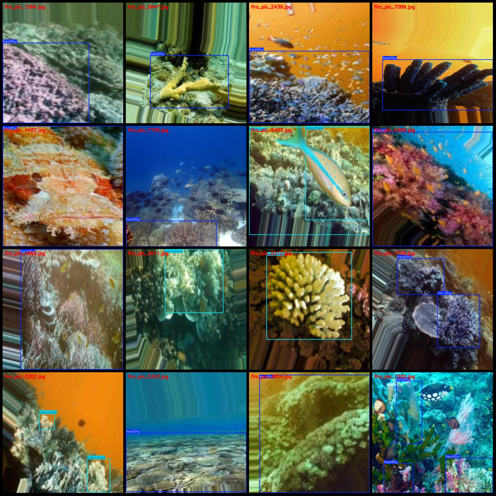
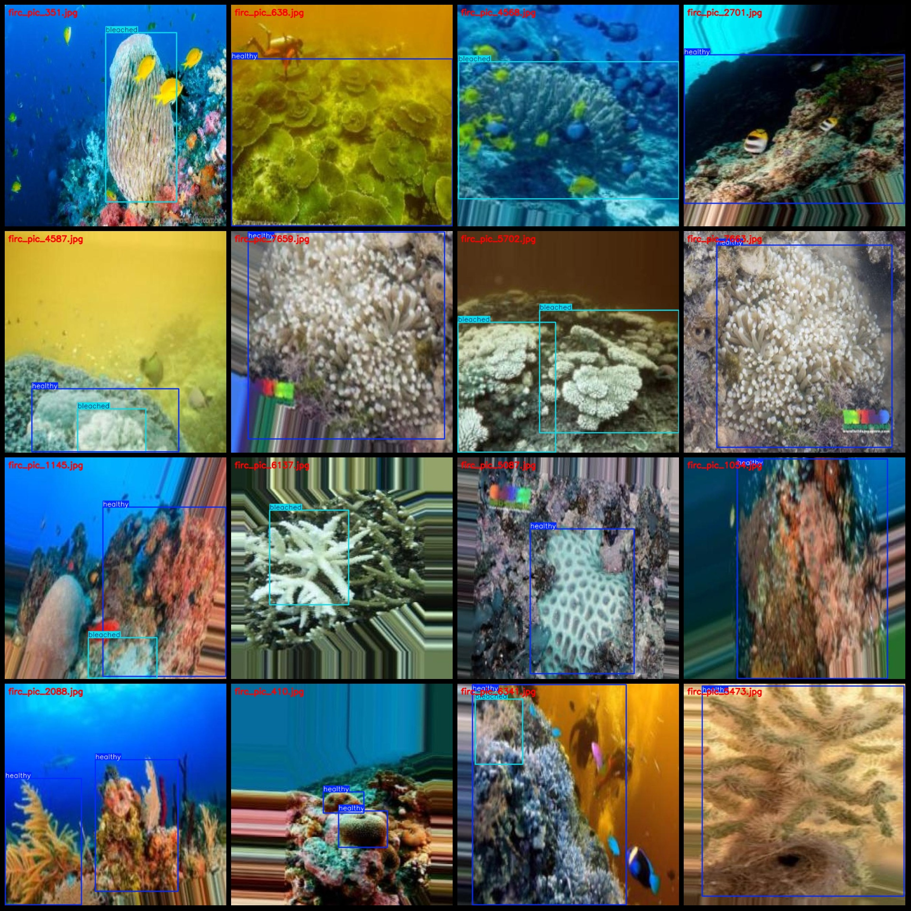

# Coral Health Status Detection and Abalone Whitening Disease Detection Dataset (VOC+YOLO format, 8007 images in 2 classes)

Dataset format: Pascal VOC format + YOLO format (txt file without split path, only containing jpg images along with corresponding VOC format xml files and YOLO format txt files).
Number of images (number of jpg files): 8007
Number of annotations (number of xml files): 8007
Number of annotations (number of txt files): 8007
Number of annotation categories: 2
Annotation category names (note that the order of labels in YOLO format does not correspond to this, but is based on the "labels" folder's "classes.txt"): ["bleached", "healthy"]
Box counts for each category:
- bleached boxes = 3740
- healthy boxes = 9086
Total box count = 12826
Number of images per category:
- bleached images = 2297
- healthy images = 6712
Image resolution: 640x640
Annotation tool used: labelImg
Annotation rules: draw a box around the category
Important note: The dataset does not have been split into training, validation, or test sets; it must be manually divided.
Special statement: This dataset does not guarantee any accuracy improvement from the trained models or weight files.
Image preview:
Annotation example:

## Images

Here is a pay link on Stripe ( https://buy.stripe.com/3cs8yP7sY87d0vu9AB ). Please contact me lonlonago@foxmail.com after funding $89, and I will send you a complete data files , thank you!

